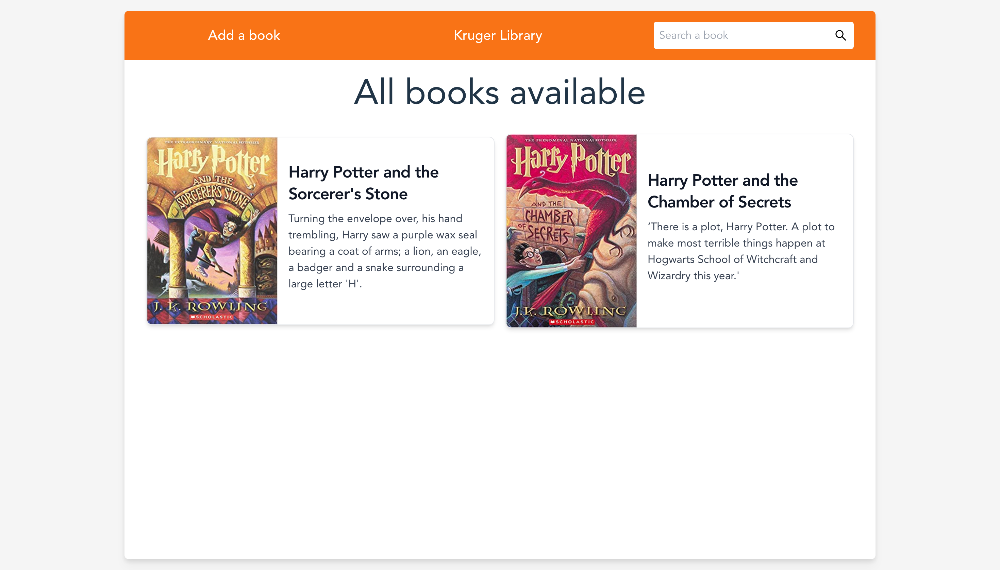
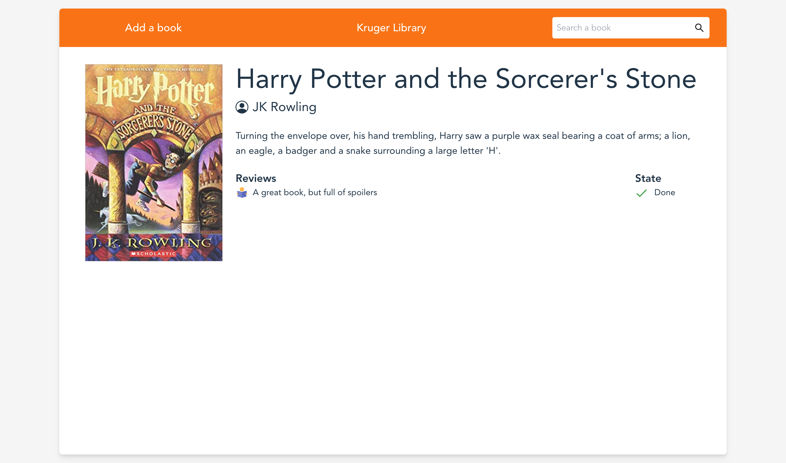
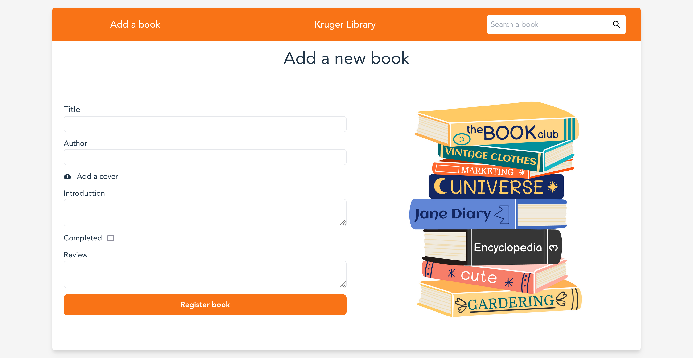

# Kruger Star - Book library

## Table of contents

- [Overview](#overview)
  - [The challenge](#the-challenge)
  - [Screenshot](#screenshot)
  - [Links](#links)
- [My process](#my-process)
  - [Built with](#built-with)
  - [What I learned](#what-i-learned)
  - [Useful resources](#useful-resources)
- [Author](#author)
- [About Kruger Star](#about-kruger-star)


## Overview

### The challenge

Users should be able to:

- Seea all books
- View details of every book in a dedicated page
- Add a new book and store it in localstorage
- See hover and focus states for all interactive elements on the page

### Screenshot






### Links

- Live Site URL: [click here](https://books-library-six.vercel.app/)

## My process

### Built with

- Semantic HTML5 markup
- CSS custom properties
- Flexbox
- [React](https://reactjs.org/) - JS library
- [Tailwind CSS](https://tailwindcss.com) - For styles
- [Vite](https://vitejs.dev)- Frotend tooling
- [React icons](https://react-icons.github.io/react-icons/)- Library full of icons


### What I learned

To use context hook, it's necesary create an object with this mimimun keys.
```js
const AppContext = createContext({
  items: [],
  createItem: (item) => {},
  getItem: (id) => {},
  updateItem: (item) => {},
});
```
After that, you can define functionality and elements of every key, in the component that become a provider. 

### Useful resources
[🔥 5 proyectos COMPLETOS en REACT JS](https://www.youtube.com/watch?v=oT-feDPuJmk&t=3788s) - In this tutorial is all the project step by step. It's illustrative in the functions that implements to create the selector.

[Tailwind CSS Cards - Flowbite](https://flowbite.com/docs/components/card/) - In this site you can access to incredible components created with Tailwind and use it in your project.

[Demo example of input type file hidden](http://jsfiddle.net/4cwpLvae/) - In this demo, the input element is hidden and pass their function to label, in order to dont show the button part of this item. This's a clean solution instead styling button input, beacuse its imposible to styling. 

[localStorage in JavaScript: A complete guide](https://blog.logrocket.com/localstorage-javascript-complete-guide/) - Guide to use localstorage, for create, read and update content in your browser. 

## Author

- Website - [Edwin Cacuango](https://edwinc.dev)
- Twitter - [@edwincacuango](https://www.twitter.com/edwincacuango)


## About Kruger Star

Kruger Star is a reality created and funding by Kruger Corporation. It help future developers to become fullstack developers, mean while they teach you about front and backend languages and tools. 
This project is a delivery part of Kruger Star initiative. For more information, visit the oficial site [here](https://ktalks.krugercorp.com/es/kruger-star-2022)
